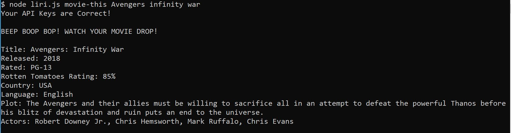

# liri-node-app

## Overview

Hello all! Thank you for stopping by to checkout this liri-node-app! In this project our goal was to create a makeshift siri, however I feel it's more of a makeshift google that makes requests to other servers to pull back information into this node application. 

## What it does

The four things this app can do are: 

    * Search for and send back information about concerts and performances of a named artist.

    * Search for and retrieve information about an inputed song title. 

    * Retrieve information and ratings about a movie title.

    * read information inputed in `random.text` file and search it with the spotify-this-song method (which will be explained later)

### Prerequisites 

    *API KEYS and IDS are needed 
        1. spotify: API KEY & ID needed.
        2. OMDB: API KEY needed.
        3. BANDS IN TOWN: API KEY needed. 

### What was used

    *NPM PACKAGES
        1. fs (general node package)
        2. axios 
        3. moment
        4. DotEnv
        5. Node-Spotify-API

### Set Up

Open your terminal and head to where `liri-node-app` is located. 

To set up a query search you need to initialize node into the terminal.

Once that is inputed, input the liri.js file. 

Now you are ready to use these methods!

### Find Concert information 

Typing `"concert-this"` will let our liri.js file understand that the concert finding method is being used. `John Mayer` is being used as our example.

After inputing that, type the artist you want to find showdates for. (This will show you bands, not rappers).

    * Retrieves:
        1. Date and Time
        2. City
        3. Country 

### Find Song information

Typing `"spotify-this-song"` will be the method used to search for songs and after it is inputed type the song you want to seach for. In this example `"your body is a wonderland"` is being searched for 

After this is inputed these are the results that will show

    *Retrieves
        1. Artist name
        2. Album name
        3. Song
        4. Song Preview url to copy

### Find a movie

Type `"movie-this"` this method will bring back information about a queried movie. `"Avengers infinity War"` is our example here.

After this is typed in these results will follow.

    *Retrieves
        1. Movie Title
        2. Released Year
        3. Rotten Tomatoes Rating
        4. Country that produced it
        5. Language spoken in the movie
        6. General Plot

### the mystical "do-what-it-says"

This is a longwinded but interesting way to query multiple songs using our `"spotify-this-song"` method. It takes the songs within each comma, removes it and then generates an array of song titles, from there it finds information for each. 

Also no need for any arguments, just input this!

This is what it returns

Open the random.txt file and knock yourself out!